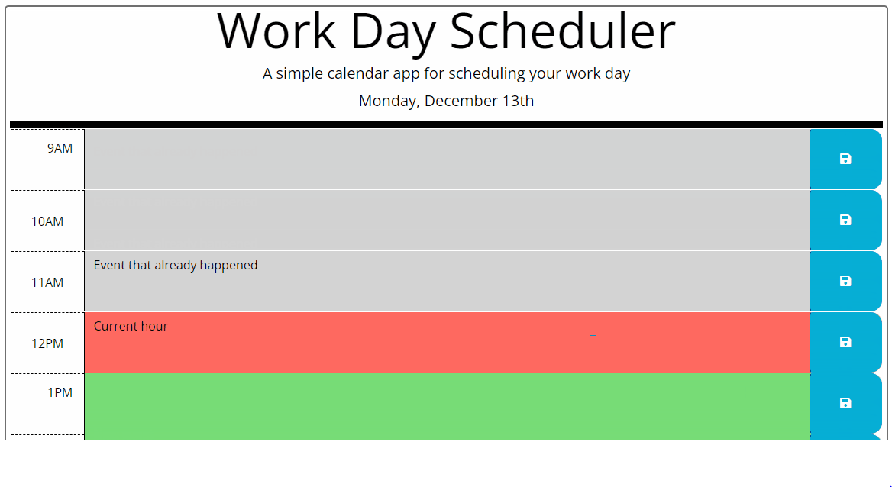

# EasyPlanner

## User Story
---
* AS AN: Employee with a busy schedule 
* I WANT: To add important events to a daily planner
* SO THAT: I can manage my time effectively

## Acceptance Criteria
---

### GIVEN: I am using a daily planner to create a schedule

* WHEN: I open the planner
* THEN: The current day is displayed at the top of the calendar
* WHEN: I scroll down
* THEN: I am presented with time blocks for standard business hours
* WHEN: I view the time blocks for that day
* THEN: Each time block is color-coded to indicate whether it is in the past, present, or future
* WHEN: I click into a time block
* THEN: I can enter an event
* WHEN: I click the save button for that time block
* THEN: The text for that event is saved in local storage
* WHEN: I refresh the page
* THEN: The saved events persist

## Mock-Up

https://kthomasnj.github.io/EasyPlanner/
 
 
 

© 2022 Keith S. Thomas